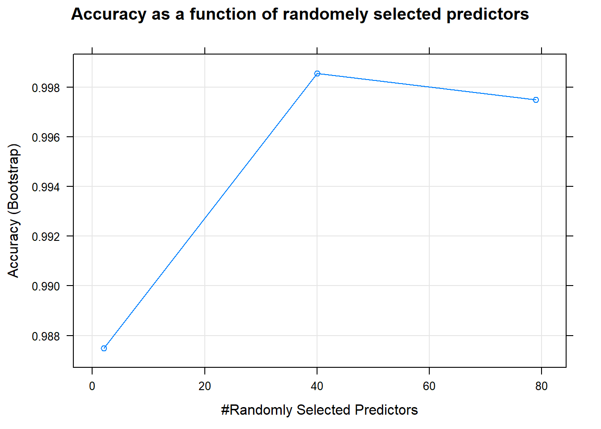
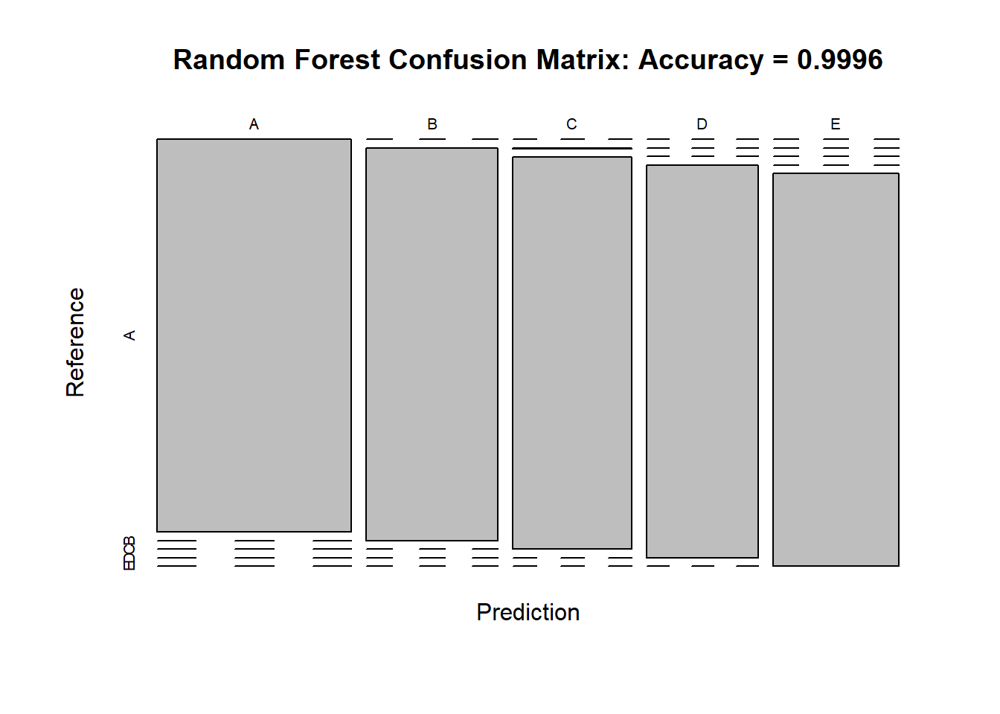

## Project Description
Using devices such as Jawbone Up, Nike FuelBand, and Fitbit it is now possible to collect a large amount of data about personal activity relatively inexpensively. These type of devices are part of the quantified self movement - a group of enthusiasts who take measurements about themselves regularly to improve their health, to find patterns in their behavior, or because they are tech geeks. One thing that people regularly do is quantify how much of a particular activity they do, but they rarely quantify how well they do it. In this project, your goal will be to use data from accelerometers on the belt, forearm, arm, and dumbell of 6 participants. They were asked to perform barbell lifts correctly and incorrectly in 5 different ways. More information is available from the website here: http://web.archive.org/web/20161224072740/http:/groupware.les.inf.puc-rio.br/har (see the section on the Weight Lifting Exercise Dataset). The data for this project come from this source: http://web.archive.org/web/20161224072740/http:/groupware.les.inf.puc-rio.br/har. 

### Data Sources
The training data for this project are available here:
https://d396qusza40orc.cloudfront.net/predmachlearn/pml-training.csv

The test data are available here:
https://d396qusza40orc.cloudfront.net/predmachlearn/pml-testing.csv

### Goal of the project
The goal of your project is to predict the manner in which they did the exercise. This is the "classe" variable in the training set. You may use any of the other variables to predict with. You should create a report describing how you built your model, how you used cross validation, what you think the expected out of sample error is, and why you made the choices you did. You will also use your prediction model to predict 20 different test cases.

## Executive Summary
For this project, we started with downloading the data from above given links. This was followed by extensive cleaning of the data, like removing any near zero variance variables and also eliminiating variables with more than 70% of NAs in the observations. Moving forward, we utilized 2 different machine elarning algorithms (could not include more due to extensive processing time) to examine the accuracy of predictions: NaiveBayes with gave 65% accuracy, and Random Forest which gave 99.9% accuracy. Out of these, Random Forest machine learning algorithm was selected to test the final test dataset. The expected out-of-sample error is calculated to be 100-99.9=0.1%

## Loading the data
We first load all the required libraries, followed by the data


```r
library(caret)
```

```
## Warning: package 'caret' was built under R version 3.4.4
```

```
## Loading required package: lattice
```

```
## Loading required package: ggplot2
```

```r
library(e1071)
```

```
## Warning: package 'e1071' was built under R version 3.4.4
```

```r
# dowanload the training test data set
url1<-"https://d396qusza40orc.cloudfront.net/predmachlearn/pml-training.csv"
url2<-"https://d396qusza40orc.cloudfront.net/predmachlearn/pml-testing.csv"
download.file(url1,"data.csv")
download.file(url2,"test.csv")

#create local dataset
trainset<-read.csv("data.csv",header=TRUE,na.strings=c("NA","#DIV/0!",""))
head(trainset[,1:10])
```

```
##   X user_name raw_timestamp_part_1 raw_timestamp_part_2   cvtd_timestamp
## 1 1  carlitos           1323084231               788290 05/12/2011 11:23
## 2 2  carlitos           1323084231               808298 05/12/2011 11:23
## 3 3  carlitos           1323084231               820366 05/12/2011 11:23
## 4 4  carlitos           1323084232               120339 05/12/2011 11:23
## 5 5  carlitos           1323084232               196328 05/12/2011 11:23
## 6 6  carlitos           1323084232               304277 05/12/2011 11:23
##   new_window num_window roll_belt pitch_belt yaw_belt
## 1         no         11      1.41       8.07    -94.4
## 2         no         11      1.41       8.07    -94.4
## 3         no         11      1.42       8.07    -94.4
## 4         no         12      1.48       8.05    -94.4
## 5         no         12      1.48       8.07    -94.4
## 6         no         12      1.45       8.06    -94.4
```

```r
testset<-read.csv("test.csv",header=TRUE,na.strings=c("NA","#DIV/0!",""))
head(testset[,1:10])
```

```
##   X user_name raw_timestamp_part_1 raw_timestamp_part_2   cvtd_timestamp
## 1 1     pedro           1323095002               868349 05/12/2011 14:23
## 2 2    jeremy           1322673067               778725 30/11/2011 17:11
## 3 3    jeremy           1322673075               342967 30/11/2011 17:11
## 4 4    adelmo           1322832789               560311 02/12/2011 13:33
## 5 5    eurico           1322489635               814776 28/11/2011 14:13
## 6 6    jeremy           1322673149               510661 30/11/2011 17:12
##   new_window num_window roll_belt pitch_belt yaw_belt
## 1         no         74    123.00      27.00    -4.75
## 2         no        431      1.02       4.87   -88.90
## 3         no        439      0.87       1.82   -88.50
## 4         no        194    125.00     -41.60   162.00
## 5         no        235      1.35       3.33   -88.60
## 6         no        504     -5.92       1.59   -87.70
```

## Cleaning the data
We clean the loaded data by first removing the variables with near zero variance, followed by removing any variable that has more than 70% NA values in observations


```r
#begin by first removing the first coloumn
train_temp<-trainset[c(-1)]
#second by removing zero variance coloumns
nzv_temp<-nearZeroVar(train_temp,saveMetrics=TRUE)
train_temp<-train_temp[,nzv_temp$nzv==FALSE]
#third by removing variables with more than 60% NA values
train1<-train_temp
count<-TRUE
for (i in 1:length(train1)){
  if (sum(is.na(train1[,i]))/nrow(train1)>=0.6)
    {count[i]<-TRUE
  }
  else
    count[i]<-FALSE
}
train1<-train1[,count==FALSE]
train_temp<-train1
# repeat above steps for test data set
testset<-testset[c(-1)]
testset<-testset[,nzv_temp$nzv==FALSE]
testset<-testset[,count==FALSE]
```

Now divide the training set into training and testing data sets for algorithms to train.


```r
# divide the training data set into train and test sets
inTrain<-createDataPartition(train_temp$classe,p=0.75,list=FALSE)
trainsub<-train_temp[inTrain,]
testsub<-train_temp[-inTrain,]
dim(trainsub)
```

```
## [1] 14718    58
```

```r
dim(testsub)
```

```
## [1] 4904   58
```

For all the below studied algorithms, we use cross-validation technique in order to avoid any overfitting and consequently improve efficiency of the modeling. We will use 5 folds for the same.

## Prediction with NaiveBayes Algorithm
Below we show the code and results with prediction for NaiveBayes algorithm.


```r
# configure parallel processing
library(parallel)
library(doParallel)
```

```
## Warning: package 'doParallel' was built under R version 3.4.4
```

```
## Loading required package: foreach
```

```
## Warning: package 'foreach' was built under R version 3.4.4
```

```
## Loading required package: iterators
```

```r
cluster <- makeCluster(detectCores() - 1) # convention to leave 1 core for OS
registerDoParallel(cluster)

# let us use cross validation process with 5 folds for each model.
cr_val<-trainControl(method="cv",number=5,allowParallel = TRUE)

# First model to test is NaiveBayes
library(e1071)
fit_nb<-naiveBayes(classe~.,data=trainsub,trcontrol=cr_val)
summary(fit_nb)
```

```
##         Length Class  Mode     
## apriori  5     table  numeric  
## tables  57     -none- list     
## levels   5     -none- character
## call     5     -none- call
```

```r
predtestsub<-predict(fit_nb,newdata=testsub)
confMat_nb<-confusionMatrix(testsub$classe,predtestsub)
confMat_nb$table
```

```
##           Reference
## Prediction   A   B   C   D   E
##          A 615 372 328  46  34
##          B  46 742 151  10   0
##          C  12 104 690  48   1
##          D   0   5 157 572  70
##          E   4   1  50 145 701
```

```r
confMat_nb$overall[1]
```

```
##  Accuracy 
## 0.6769984
```

```r
# NaiveBayes model gives 65% accuracy
```

As seen above, NaiveBayes gives 65% accuracy

## Prediction with Random Forest Algorithm
Below we utilize Random Forest Algorithm for testing


```r
#second model to use is Random Forest
fit_rf<-train(classe~.,data=trainsub,trcontrol=cr_val,method="rf")
summary(fit_rf)
```

```
##                 Length Class      Mode     
## call                5  -none-     call     
## type                1  -none-     character
## predicted       14718  factor     numeric  
## err.rate         3000  -none-     numeric  
## confusion          30  -none-     numeric  
## votes           73590  matrix     numeric  
## oob.times       14718  -none-     numeric  
## classes             5  -none-     character
## importance         79  -none-     numeric  
## importanceSD        0  -none-     NULL     
## localImportance     0  -none-     NULL     
## proximity           0  -none-     NULL     
## ntree               1  -none-     numeric  
## mtry                1  -none-     numeric  
## forest             14  -none-     list     
## y               14718  factor     numeric  
## test                0  -none-     NULL     
## inbag               0  -none-     NULL     
## xNames             79  -none-     character
## problemType         1  -none-     character
## tuneValue           1  data.frame list     
## obsLevels           5  -none-     character
## param               1  -none-     list
```

```r
predtestsub<-predict(fit_rf,newdata=testsub)
confMat_rf<-confusionMatrix(testsub$classe,predtestsub)
confMat_rf$table
```

```
##           Reference
## Prediction    A    B    C    D    E
##          A 1395    0    0    0    0
##          B    1  948    0    0    0
##          C    0    0  855    0    0
##          D    0    0    1  802    1
##          E    0    0    0    0  901
```

```r
confMat_rf$overall[1]
```

```
##  Accuracy 
## 0.9993883
```

```r
plot(fit_rf,main="Accuracy as a function of randomely selected predictors")
```

<!-- -->

```r
plot(confMat_rf$table, main = paste("Random Forest Confusion Matrix: Accuracy =", round(confMat_rf$overall['Accuracy'], 4)))
```

<!-- -->

```r
#Random Forest gives 99.9%  accuracy
stopCluster(cluster)
registerDoSEQ()
```

Random Forest geenrates 99.9% accuracy.

## Conclusion
The above analysis shows that Random Forest gives the closest prediction in the training data set. The expected out of sample error is 100-99.9=0.1%
We will now use 'fit_rf' for predicting the test set as below.


```r
predict_test<-predict(fit_rf,newdata=testset)
predict_test
```

```
##  [1] B A B A A E D B A A B C B A E E A B B B
## Levels: A B C D E
```
